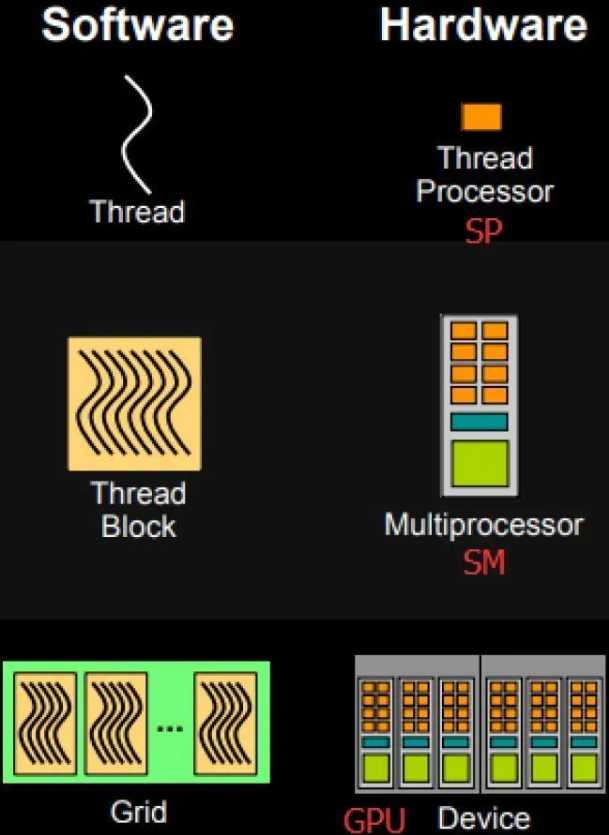

### GPU 编程模型 vs 硬件层级

| 编程模型层级                  | 说明                   | 硬件对应层级/单元                                   | 备注                        |
| ----------------------- | -------------------- | ------------------------------------------- | ------------------------- |
| **Grid（网格）**            | 一个Kernel启动的所有线程组成的集合 | **整个GPU芯片内所有SM（Streaming Multiprocessors）** | GPU中多个SM协同执行整个Grid的线程     |
| **Block（线程块）**          | 线程的分组，线程块内线程共享内存     | **单个SM内执行的线程组（Block被映射到一个SM）**              | 一个SM同时处理一个或多个Block（资源允许时） |
| **Thread（线程）**          | 线程块内的单个线程            | **SM内部的单个线程上下文（寄存器组+程序计数器）**                | 每个线程有独立寄存器状态和指令流          |
| **Warp（线程束）**           | 32个线程组成的调度执行单元       | **SM内硬件执行单元调度的基本执行单位——Warp Scheduler**      | 32个线程同步执行同一条指令（SIMD执行）    |
| **Shared Memory（共享内存）** | Block内线程共享的快速存储      | **SM内物理共享内存（BRAM）**                         | 用于线程间高速通信和同步              |
| **Global Memory（全局内存）** | GPU所有线程可访问的全局存储      | **GPU芯片外部的显存（DRAM）及L2 Cache层**              | 访问延迟最高，带宽受限               |

### GPU 图像渲染
https://zhuanlan.zhihu.com/p/137780634

